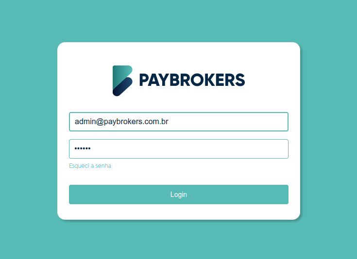
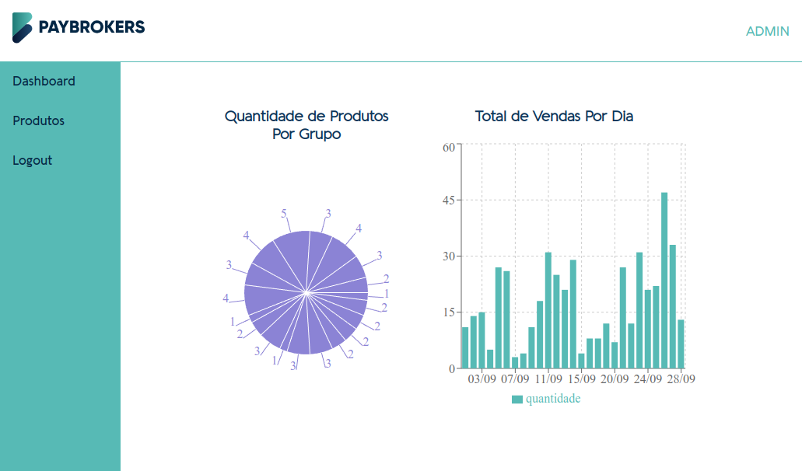
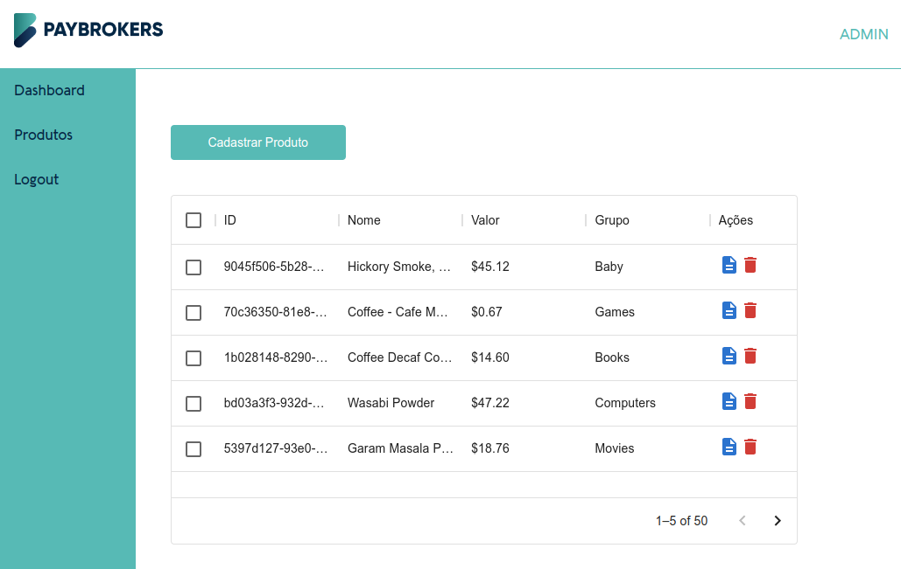

# Paybrokers Dashboard

**Paybrokers Dashboard** is **ReactJS/Vite** App with **TypeScript**, **Styled-Components**, **Material-UI**, **React Hook Form**, **ESLint** and **Tests** applying concepts from **Clean Architecture** and **Clean Code**



### Product Entity

```json
{
  "id": "fc4d3ba2-c440-409c-9dba-16b3b4eb0cc8",
  "name": "Langers - Ruby Red Grapfruit",
  "price": "$6.46",
  "group": "Games",
  "createdAt": 1627700291000
}
```

### Sell Entity

```json
{
  "id": "6dc66e8e-0097-45df-ac06-753005ad9ca7",
  "product": "Wine - Sogrape Mateus Rose",
  "quantity": 5,
  "sellDate": "1661577003000"
}
```

### How to test locally

```bash
  # Install dependencies
  yarn

  # Run tests once
  yarn test
```

### How to start locally

```bash
  # Install dependencies
  yarn

  # Start development server
  yarn dev
```

### Authentication

```bash

  email: 'admin@paybrokers.com.br'
  passsword: '123456'
  
```

---

### Telas

#### Dashboard

#### Produtos
